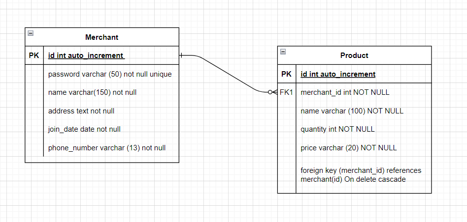

# MERCHANT SERVICES

### Description

This is a mini project that is usually done in e-commerce company to manage a catalog fo products by merchants on their platform. It enables merchants to use the plaform easily and safely. The merchants own the capability to manage their accounts such as creating and deleting accounts, adding, updating, viewing and deleting the products in their catalog.
There are several challenges that I faced during building this such as using yup to validate inputted data in the fields (request parameters and request body). I dealt to make sure the passwords must meet the requirements , because some wanted mehods are not provided (such as uppercase, lowercase, number and symbols for passwords validation). I also learned about when I need to set the strict mode for this.

## ARCHITECTURE DIAGRAM


## DATABASE MODEL (ERD)



## API CONTRACT

## Merchant

## Merchant object

```
{
id: integer auto_increment
password: string unique
name: string unique
addresst: string
join_date: datetime(iso 8601)
phone_number: strin
}
```

## POST /merchant

Creates a new Merchant and returns the new object.

- **URL Params**
  <br>Non
- **Headers** <br>
  Content-Type: application/json
- **Data Params** <br>

  ```
  password: string,
  ame: string,<br>
  addresst: string,<br>
  join_date: datetime(iso 8601),<br>
  phone_number: string<br>

  ```

- **Success Response:**
  - **Code:** 200
  - **Content:**
    ```
    { payload :  data {
    isSuccess: result.affectedRows,
    id: result.insertId,
    },
    message : "Your account is successfully created"}
    ```
- **Error Response:**
  - **Code:** 400
  - **Content:**
  ```
  { payload : error.name, message : error.message }
  ```

## DELETE /merchant/:id

Deletes the specified merchant.

- **URL Params** <br>
  Required: id=[integer]
- **Data Params**<br>
  None
- **Headers**<br>
  Content-Type: application/json<br>
  Authorization: Basic Auth
- **Success Response:**
- **Code:** 200
  **Content:** {
  payload : data {result.affectedRows},
  message : "Your account has been deleted"
  }
  Error Response:
- **Code:** 404
- **Content:** {
  payload : "Error"
  message : "The account is not found" }
  OR
- **Code:** 400
- **Content:**
  ```
  { payload : error.name,
  message : error.message }
  ```
      OR
- **Code:** 401
- **Content:**
  ```
  { payload : "No Authentication Data Found",
  message : "Unauthorized." }
  ```

## Products

## Product object

```
{
id: integer auto_increment
merchant_id: string
name: string
quantity: integer
price : string
}
```

## GET /product

Returns all products in the system.

- **URL Params** <br>
  None
- **Data Params**<br>
  ```
  {
  merchant_id: string
  }
  ```
- **Headers** <br>
  Content-Type: application/json<br>
  Authorization: Basic Auth
- **Success Response:**
- **Code:** 200
- **Content:**
  ```
  {
  payload: [
  {<product_object>},
  {<product_object>},
  {<product_object>}
  ],
  message: "Here are your products"
  }
  ```
- **Error Response:**
  - **Code:** 404
  - **Content:**
    ```
    {
    payload : "Result is not found/undefined"
    message : "Your product is not found" }
    ```
    OR
  - **Code:** 400
  - **Content:**
    ```
    {
    payload : error.name,
    message : error.message }
    ```
    OR
  - **Code:** 401
  - **Content:**
    ```
    {
    payload : "No Authentication Data Found",
    message : "Unauthorized." }
    ```

## GET /product/:id

Returns the specified product.

- **URL Params** <br>
  Required: id=[integer]
- **Data Params**<br>
  None
- **Headers**<br>
  Content-Type: application/json<br>
  Authorization: Basic Auth
- **Success Response:**
- **Code:** 200
- **Content:**
  ```
  {
  payload: [
  {<product_object>}
  ],
  message: "Here are your products"
  }
  ```
- **Error Response:**
  - **Code:** 404
  - **Content:**
    ```
    {
    payload : "Result is undefined"
    message : "Your product is not found" }
    ```
    OR
  - **Code:** 400
  - **Content:**
    ```
    {
    payload : error.name,
    message : error.message }
    ```
    OR
  - **Code:** 401
  - **Content:**
    ```
    {
    payload : "No Authentication Data Found",
    message : "Unauthorized." }
    ```

## POST /products

Creates a new Product and returns the new object.

- **URL Params**<br>
  None
- **Data Params**
  ```
  {
  merchant_id: string,
  name: string,
  quantity: integer,
  price : string
  }
  ```
- **Headers**<br>
  Content-Type: application/json<br>
  Authorization: Basic Auth
- **Success Response:**
- **Code:** 200
- **Content:**
  ```
  {
  payload : data {
  isSuccess : result.affectedRows,
  ProductID : resutl.insertId
  },
  message : "Your new product has been successfully stored in the database"}
  ```
- **Error Responses:**

  - **Code:** 400
  - **Content:**

    ```
    {
    payload : error.name,
    message : error.message }
    ```

    OR

  - **Code:** 401
  - **Content:**
    ```
    {
    payload : "No Authentication Data Found",
    message : "Unauthorized." }
    ```

## PUT /product/:id

Updates fields on the specified product and returns the updated object.

- **URL Params**<br>
  Required: id=[integer]
- **Data Params**
  ```
  {
  merchant_id: string,
  name: string,
  quantity: integer,
  price : string
  }
  ```
- **Headers**<br>
  Content-Type: application/json<br>
  Authorization: Basic Auth
- **Success Response:**
- **Code:** 200
- **Content:**
  ```
  {
  payload : data{
  isSucces : result.affectedRows,
  message : result.message,
  },
  message : `The product with the ID = ${id} is updated`}
  ```
- **Error Response:**
  - **Code:** 404
  - **Content:**
    ```
    {
    payload : "Error updating product",
    message : `The product with the ID = ${id} is not found`}
    ```
    OR
  - **Code:** 400
  - **Content:**

    ```
    {
    payload : error.name,
    message : error.message }
    ```

    OR

  - **Code:** 401
  - **Content:**
    ```
    {
    payload : "No Authentication Data Found",
    message : "Unauthorized." }
    ```

## DELETE /product/:id

Deletes the specified product.

- **URL Params**<br>
  Required: id=[integer]
- **Data Params**<br>
  None
- **Headers**<br>
  Content-Type: application/json<br>
  Authorization: Basic Auth
- **Success Response:**
- **Code:** 200
- **Content:**
  ```
  {
  payload : data {isDeleted : result.affectedRows},
  message : `Your product with ID = ${id} has been deleted`
  }
  ```
- **Error Response:**
  - **Code:** 404
  - **Content:**
    ```
    {
    payload : error,
    message : `Your product with ID = ${id} is not found` }
    ```
    OR
  - **Code:** 400
  - **Content:**
    ```
    {
    payload : error.name,
    message : error.message }
    ```
    OR
  - **Code:** 401
  - **Content:**
    ```
    {
    payload : "No Authentication Data Found",
    message : "Unauthorized." }
    ```
